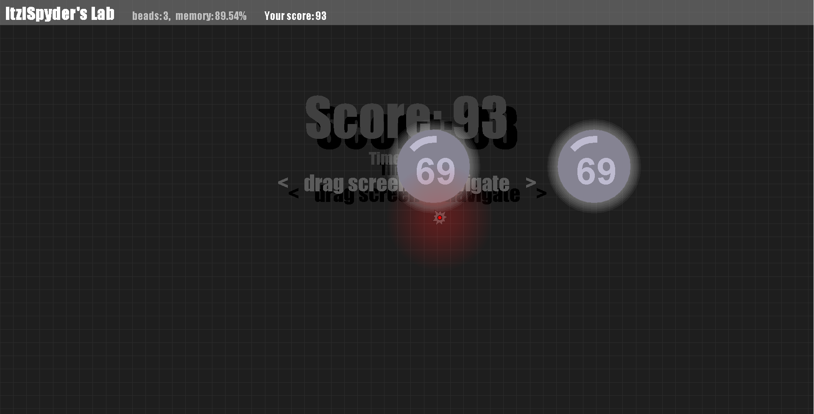
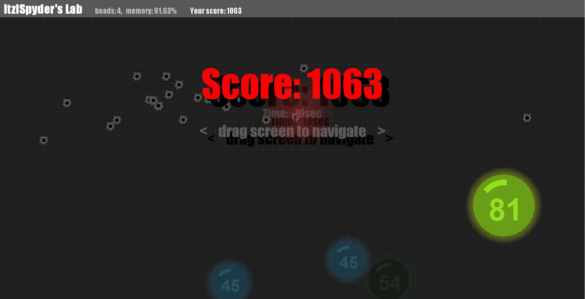
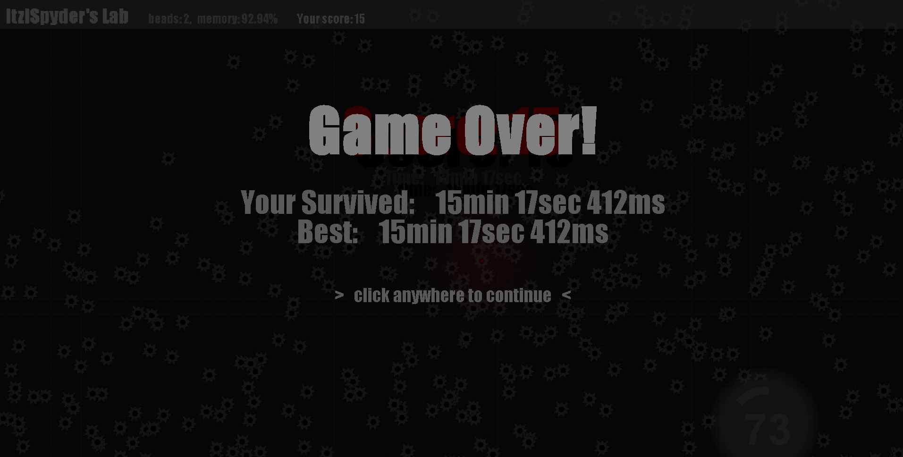

# DotChaos
Submerged in an infinite 2d world where dots fall out of the sky.

----------

## Tips:
- Shoot the dots by hovering over them
- Drag cursor to navigate throughout the world
- Target the large ones first because they sometimes split into smaller ones!

- Gain health score by shooting at the beads! The score gained would the the number displayed on the bead.
- Letting beads touch the floor or despawn (when they turn gray) would result in taking damage 5x the amount displayed on the bead.
- Larger beads split into smaller ones!

- A health score less than or equal to 0 would result in death!
- (yes i got 15 min im just that good ykyk)

